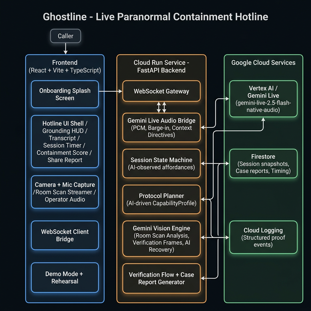

# Ghostline

Ghostline is a live paranormal containment hotline built for the **Gemini Live Agent Challenge**.

The experience is voice-first, camera-aware, interruptible, and cloud-hosted. A caller speaks with **The Archivist, Containment Desk**, who requests camera access in-call, scans the room with Gemini Vision to identify available objects, guides the caller through an AI-selected containment protocol, verifies progress using Gemini's visual analysis, provides AI-reasoned recovery when steps fail, and ends the session with a scored case report.


`HauntLens` appears in some UI and historical prompt text because it was the earlier working name. Ghostline is the primary product identity.

## Why This Is A Live Agents Submission

Ghostline is designed around the challenge's Live Agents criteria:

- real-time voice interaction
- camera-aware interaction with staged verification
- natural barge-in that stops operator audio immediately
- a distinct operator persona with visible grounding
- Google Cloud hosting and persistence
- Gemini Live on Vertex AI for live multimodal interaction

This is not a chatbot skin or a fake call simulation. The call path, interruption handling, verification flow, recovery ladders, state machine, persistence, and case report are all explicit parts of the implementation.

## Feature Summary

- Live hotline call flow with **The Archivist, Containment Desk**
- **Onboarding splash screen** with "Start the Hotline" CTA
- In-call camera and mic permission flow
- **Gemini Vision room scan** — Gemini sees the caller's room and narrates observations
- **AI-driven task selection** — room scan observations determine which containment tasks are assigned
- Gemini Live audio input and output bridged through the FastAPI backend
- Always-on subtitles for user and operator transcript lines
- Grounding HUD with task, path, verification, recovery, and turn-state visibility
- **Gemini Vision verification** — captured frames analyzed by AI during "Ready to Verify" moments
- **AI-reasoned recovery** — when verification fails, Gemini provides specific correction advice
- **Adaptive dialogue** — Gemini generates contextual operator lines based on verification results
- Honest verification results: `confirmed`, `unconfirmed`, `user_confirmed_only`
- Deterministic recovery ladders for verification failure and capability failure
- **Containment score** — calculated from verification outcomes, displayed as a gradient progress bar
- **Session timer** — live MM:SS timer visible during the call
- **Share report** — one-tap sharing via Web Share API or clipboard
- Structured case report artifact with alternate ending templates
- Demo mode with fixed path, fixed beats, and rehearsal harness
- Firestore session persistence and structured cloud-proof logging support

## Architecture Summary

### Client

- React + Vite + TypeScript
- WebSocket session manager for realtime transport
- Operator audio playback, mic capture, staged frame capture, HUD, transcript layer, control bar, demo-mode rehearsal support

### Server

- Python + FastAPI
- WebSocket gateway and authoritative session state machine
- Gemini Live session manager on Vertex AI
- Gemini Vision engine for room scan analysis and verification frame analysis
- AI-driven CapabilityProfile from room scan observations
- AI-reasoned recovery directives on verification failure
- Protocol planner, verification engine, recovery logic, flavor/diagnosis libraries, case report generation
- Firestore persistence and structured logging

### Cloud

- Cloud Run for backend hosting
- Firestore for session persistence and timing metadata
- Cloud Logging for proof-grade operational logs
- Vertex AI / Gemini Live (`gemini-live-2.5-flash-native-audio`) for realtime multimodal interaction

## Repo Layout

- `client/` frontend app
- `server/` FastAPI backend
- `shared/` shared constants and mirrored contracts
- `docs/` product, demo, build, deployment, and recording guidance
- `assets/audio/` source audio assets and notes
- `assets/demo/` demo support assets

## Source Of Truth

These documents govern the build and should be treated as canonical:

- [docs/PRODUCT_CONTEXT.md](docs\PRODUCT_CONTEXT.md)
- [docs/DEMO_MODE.md](docs\DEMO_MODE.md)
- [docs/BUILD_GUIDE.md](docs\BUILD_GUIDE.md)

## Quick Start

> Requires **Python 3.11+**, **Node.js 18+**, and a Google Cloud project with **Vertex AI** enabled.

### 1. Clone & Configure

```bash
git clone https://github.com/YashSerai/GhostLine-for-Gemini-Live-Agent-Challenge.git
cd GhostLine-for-Gemini-Live-Agent-Challenge
cp .env.example .env
# Edit .env with your Google Cloud project ID, credentials path, etc.
```

### 2. Start the Server

```bash
cd server
python -m venv .venv

# Activate the virtual environment:
# Linux/macOS:
source .venv/bin/activate
# Windows:
# .\.venv\Scripts\activate

pip install --upgrade pip
pip install -r requirements.txt
uvicorn app.main:app --reload --host 127.0.0.1 --port 8000
```

### 3. Start the Client

```bash
cd client
npm install
npm run dev
```

### 4. Open the App

- **Normal mode**: [http://127.0.0.1:5173](http://127.0.0.1:5173)
- **Demo mode**: [http://127.0.0.1:5173/?demo=1](http://127.0.0.1:5173/?demo=1)
- **Rehearsal**: [http://127.0.0.1:5173/?demo=1&rehearsal=1](http://127.0.0.1:5173/?demo=1&rehearsal=1)

## Environment Variables

Copy `.env.example` to `.env` and fill in the required values.

Key variables:

| Variable | Description |
|----------|-------------|
| `GOOGLE_CLOUD_PROJECT` | Your GCP project ID |
| `GOOGLE_CLOUD_LOCATION` | Region (e.g., `us-central1`) |
| `VERTEX_AI_MODEL` | `gemini-live-2.5-flash-native-audio` |
| `GOOGLE_APPLICATION_CREDENTIALS` | Path to service account JSON |
| `VITE_SESSION_WS_URL` | WebSocket URL (default: `ws://127.0.0.1:8000/ws/session`) |
| `FIRESTORE_DATABASE` | Firestore database ID |
| `DEMO_MODE_DEFAULT` | `true` for demo mode by default |

## Useful Endpoints

- `GET /healthz` — liveness check
- `GET /readyz` — readiness check
- `GET /ops/proof/active-session` — cloud proof: shows active session ID
- `ws://127.0.0.1:8000/ws/session` — WebSocket session transport

## Demo Replay

### Normal Demo Mode

Open:

- [http://127.0.0.1:5173/?demo=1](http://127.0.0.1:5173/?demo=1)

Demo mode locks the judged path to a deterministic sequence and fixed beats.

### Rehearsal Harness

Open:

- [http://127.0.0.1:5173/?demo=1&rehearsal=1](http://127.0.0.1:5173/?demo=1&rehearsal=1)

The rehearsal harness shows the fixed demo path and whether the scripted barge-in, near-failure recovery, and final report all landed.

### Demo Procedure

Supporting demo docs:

- [docs/DEMO_PROCEDURE.md](docs\DEMO_PROCEDURE.md) for setup and rehearsal
- [docs/DEMO_SCRIPT.md](docs\DEMO_SCRIPT.md) for the timed recording script and shot plan
- [docs/DEVPOST_SUBMISSION.md](docs\DEVPOST_SUBMISSION.md) for Devpost-ready submission copy
- [docs/PUBLIC_BUILD_POST.md](docs\PUBLIC_BUILD_POST.md) for the public build post draft

## Deployment Overview

The backend is prepared for Cloud Run deployment with:

- FastAPI app entrypoint
- Dockerfile
- `.dockerignore`
- `.gcloudignore`
- environment-driven runtime config
- health endpoints and WebSocket route

Deployment docs:

- [docs/CLOUD_RUN_DEPLOYMENT.md](docs\CLOUD_RUN_DEPLOYMENT.md)
- [docs/AUTOMATED_DEPLOY.md](docs\AUTOMATED_DEPLOY.md)

The deployed backend is intended to run with:

- Cloud Run
- Vertex AI / Gemini Live
- Firestore
- Cloud Logging

## Cloud Proof Note

Prompt 50 adds operational support for recording the required cloud-proof clip.

Use:

- `GET /ops/proof/active-session` to identify the active demo session
- Firestore `proof.*` fields to find the same session document
- structured log events such as `cloud_proof_session_locator`, `session_started`, `gemini_live_session_created`, and `case_report_generated`

Recording checklist:

- [docs/CLOUD_PROOF_CHECKLIST.md](docs\CLOUD_PROOF_CHECKLIST.md)

## Privacy And Safety Notes

Ghostline is designed around procedural containment fiction, but the implementation still takes privacy and safety boundaries seriously.

- camera and mic are requested **in-call**, not as generic pre-setup
- the system should only use staged verification windows, not pretend to see more than it can verify
- the operator is required to express uncertainty honestly
- the product should not identify people in frame, profile users, or tie behavior to personal traits
- raw media is not intended as long-term storage; the cloud-native path emphasizes structured state and event persistence instead
- mock verification should remain disabled for serious demo and cloud-proof runs unless a prompt explicitly requires it

## Headphones Recommended

Headphones are recommended for the best demo and rehearsal experience.

They are not required, but they help with:

- hearing subtle operator lines
- keeping pre-baked ambience readable without masking speech
- making the barge-in and audio-ducking behavior easier to hear clearly

## Additional Docs

- [server/README.md](server\README.md)
- [docs/CLOUD_RUN_DEPLOYMENT.md](docs\CLOUD_RUN_DEPLOYMENT.md)
- [docs/AUTOMATED_DEPLOY.md](docs\AUTOMATED_DEPLOY.md)
- [docs/CLOUD_PROOF_CHECKLIST.md](docs\CLOUD_PROOF_CHECKLIST.md)
- [docs/DEMO_PROCEDURE.md](docs\DEMO_PROCEDURE.md)
- [docs/DEMO_SCRIPT.md](docs\DEMO_SCRIPT.md)
- [docs/DEVPOST_SUBMISSION.md](docs\DEVPOST_SUBMISSION.md)
- [docs/PUBLIC_BUILD_POST.md](docs\PUBLIC_BUILD_POST.md)

## Status

This repository includes the full Ghostline lifecycle:

- Onboarding splash screen
- Live call transport with session timer
- Gemini Live audio bridge
- Gemini Vision room scan with AI-driven task selection
- Gemini Vision verification with AI-reasoned recovery
- Adaptive dialogue via context directives
- Deterministic planner, state machine, and recovery ladders
- Containment score and share report
- Case report generation
- Demo mode and rehearsal support
- Cloud deployment and proof instrumentation
